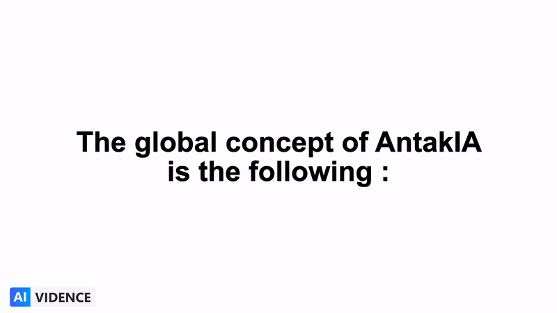
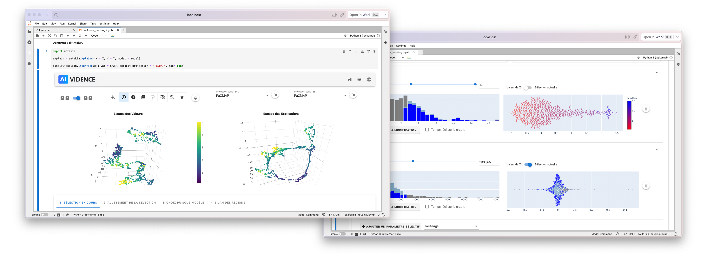

<div align="center">

  
  </br>
  
  <p>
    La solution XAI qui parle à tout le monde
  </p>

<!-- Badges -->
<p>
<i>
Insertion ici des badges
</i>
</p>
   
<h4>
    <a href="https://github.com/Louis3797/awesome-readme-template/">View Demo</a>
  <span> · </span>
    <a href="https://github.com/Louis3797/awesome-readme-template">Documentation</a>
  <span> · </span>
    <a href="https://github.com/Louis3797/awesome-readme-template/issues/">Report Bug</a>
  <span> · </span>
    <a href="https://github.com/Louis3797/awesome-readme-template/issues/">Request Feature</a>
  </h4>
</div>

<br />

<!-- Table of Contents -->

# :notebook_with_decorative_cover: Table of Contents

- [About the Project](#star2-about-the-project)
    - [Our idea](#idea)
    - [Screenshots](#camera-screenshots)
    - [Features](#dart-features)
- [Getting Started](#toolbox-getting-started)
  - [Installation using pip](#gear-installation)
  - [Installation with Docker](#test_tube-running-tests)
- [Usage](#eyes-usage)
- [Data types](#compass-roadmap)
- [Contributing](#wave-contributing)
  - [Code of Conduct](#scroll-code-of-conduct)
- [FAQ](#grey_question-faq)
- [License](#warning-license)
- [Contact](#handshake-contact)
- [Acknowledgements](#gem-acknowledgements)

<!-- About the Project -->

## :star2: About the Project

<!-- Notre idée -->

### :thought_balloon: Our idea

Our Python library combines all the steps of our regional approach for your model:
* Simultaneous "dyadic" exploration of the value and explanation spaces of your model to be explained,
* Automatic recommendation of dyadic segmentation (regions that are both homogeneous in the 2 spaces) or manual selection
* For each region, expression of the selection made by the input or explained variables (cf. "Skope rules")
* Possibility of refining the definition of regions for each attribute (see "flows")
* For each region, a surrogate model is proposed from a library (including PiML and iModels)
* Performance, continuity and completeness testing of the final model

<div align="center"> 
  
</div>

<!-- Screenshots -->

### :camera: Screenshots

<div align="center"> 
  
</div>


<!-- Getting Started -->

## :computer: Getting Started

<!-- Installation -->

### :gear: Installation with pip

Install using `pip`

```
pip install antakia
```

<!-- V-env -->

### :whale: Installation with docker

Be sure to have a Docker engine running on your computer.

```
docker build -t antakia .
docker run -p 8888:8888 antakia
```


<!-- Usage -->

## :eyes: Usage

Example of usage (find more example in the <a href="https://code.ai-vidence.com/laurent/antakia/">example</a> folder)

In a notebook :

```python
import pandas as pd
df = pd.read_csv('data/california_housing.csv')
X = df.iloc[:,0:8]
Y = df.iloc[:,9]
```

```python
from sklearn.ensemble import GradientBoostingRegressor
model = GradientBoostingRegressor(random_state = 9)
model.fit(X, Y)
```

```python
import antakia
explain = antakia.Xplainer(X = X, Y = Y, model = model)
display(explain.interface(explanation = SHAP, default_projection = "PaCMAP"))
```

<!-- Roadmap -->

## :compass: Type of data currently dealt with

- [x] Tabular data
- [ ] Time series
- [ ] Images

<!-- Contributing -->

## :wave: Contributing

Contributions are always welcome!

See `CONTRIBUTING.md` for ways to get started.

<!-- Code of Conduct -->

### :scroll: Code of Conduct

Please read the [Code of Conduct](https://github.com/Louis3797/awesome-readme-template/blob/master/CODE_OF_CONDUCT.md)

<!-- FAQ -->

## :grey_question: FAQ

- Is AntakIA open source ?

  - Yes ! And forever !

- Can I transfer my computations on a huge GPU ?

  - Yes, very soon on the [ai-vidence](www.ai-vidence.com) website

<!-- License -->

## :warning: License

Distributed under the no License. See LICENSE.txt for more information.

<!-- Contact -->

## :handshake: Contact

:computer: [www.ai-vidence.com](www.ai-vidence.com)

:inbox_tray: laurent@ai-vidence.com

:inbox_tray: david@ai-vidence.com


<!-- Acknowledgments -->

## :gem: Acknowledgements

We wrote this paper about AntakIA :
[Antakia](www.ai-vidence.com)
