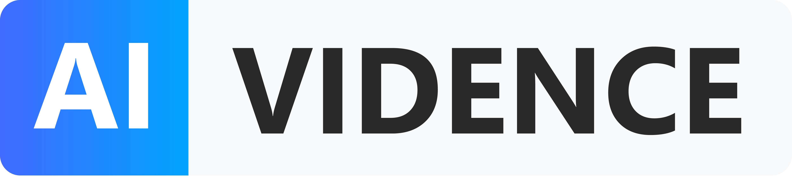

# About us

Hi! AntakIA has been first released by [AI-vidence](https://www.ai-vidence.com) a French start-up commited to AI explainabily and trusted AI in general.

AntakIA is our open-source product. It adresses the need for transparence and understanding on how ML models work. Some companies will use it for compliance with the coming [AI act](https://eur-lex.europa.eu/legal-content/FR/TXT/?uri=CELEX%3A52021PC0206). Others will use it to foster adoption of the model : internally or with clients. Also data scientists will benefit from AntakIA to better build models on their dataset.

Besides AntakIA, AI-vidence proposes complete paid solutions for some industries. Please visit www.ai-vidence.com for mmore details.

It was really important for us to release it open-source. All data scientists in the world heavily rely on open-souce tools : Python, Jupyter, Scikit-learn, Pandas, to name a few. We believe it is fair to release a complete and useful version of our product open-source.

The AntakIA method was invented in 2021. Very soon, we got evidence (!) of interest for it. The ACPR, French regulatory for banks, awarded us for AntakIA in a explainability hackathon. The year after we joined Confiance.ai a French industrial collective funded by the French State.

We're currently working with major corporates to explain their models and improve our product.