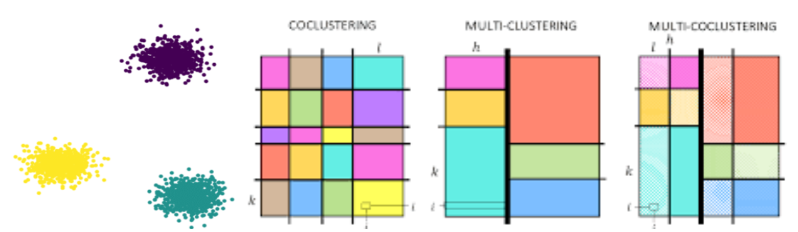

# Clustering dyadique

L'approche d'AntakIA repose sur une segmentation jointe de deux espaces: un espace des valeurs $l'EV$ qui représente les observations réelles et un espace d'explications $l'EE$ dont les objets sont des valeurs d'explications locales des observations ( valeurs SHAP, LIME, etc)  . L'objectif étant d'identifier des zones d'objets similaires dans $l'EV$ et homogènes en explications afin d'y substituer le modèle initial *black-box* par des sous-modèles explicables tels une *régression linéaire, un arbre de décision, ...* 
Cette double  exploration donne son nom au **clustering dyadique**.

## Se repérer dans la littérature
#### Autour du clustering
 Une brève analyse des thèmes proches pour se repérer: 

> Le  **clustering**  en  général  est  une  méthode  d'analyse  de  données  qui  regroupe  des  objets similaires en fonction de leurs caractéristiques communes. De nombreux algorithmes non supervisés répondent au besoin de classification des éléments d’un espace donné (Kmeans, DBSCAN, Hiérarchique, etc)
 Le  **coclustering**  regroupe des observations simultanément proches entre elles en moyenne, mais également par blocs, en  identifiant des sous-groupes cohérents dans une matrice de données. Le **multi-coclustering** est une extension  du  coclustering  qui  permet  de  regrouper  plusieurs  ensembles  d'objets  et  d'attributs  de manière simultanée et cohérente.        
 Le **clustering multivues** quant à lui est une approche de clustering qui utilise plusieurs sources de  données  ou  vues  différentes pour regrouper  les objets en prenant en compte simultanément différentes perspectives. 
{.align-center}
{.is-info}
#### Autour de l'explication locale
> Le modèle **SHAP** (SHapley Additive exPlanations) mesure pour chaque observation la contribution de chaque variable à la différence entre la valeur prédite par le modèle et la moyenne des prédictions de toutes les observations. Ces valeurs fournissent donc une mesure de l'importance de chaque caractéristique dans une prédiction de modèle, en utilisant une approche basée sur la coalition de variables.
Le modèle **LIME** (Local Interpretable Model-agnostic Explanations) cherche à expliquer la prédiction d’une observation par analyse de son voisinage; Par pertubation d'une instance, il étudie les prédictions du modèle sur ce voisinage et utilise une approximation linéaire sur ce voisinage pour expliquer la prédiction de l'instance.)
 [interpreting-machine-learning-models-lime-and-shap](https://svitla.com/blog/interpreting-machine-learning-models-lime-and-shap)
 {.is-info}

## Idées d'implémentation 
Dans l’approche d’Antakia les modèles en coclustering sont limités car l’on dispose non pas d’un mais de deux espaces, deux tableaux de données.  

- Une  première  idée  (naïve !) implémentée  était  de  concaténer  ces  deux  tableaux  et  réaliser  un  co-clustering/multi-clustering,  mais  deux  problèmes  se  posent :
1. Face  à  l’interprétation  des  résultats obtenus, les valeurs dans l’espace des explications et celles dans l’espace des valeurs n’ont  pas  la  même  signification  de  ce  fait,  rassembler  par  similarité  deux  attributs  de  ces espaces est clairement non-pertinent.
2. En regard de l’implémentation machine, un élément important dans le clustering est  la  standardisation  des données,  elle  réduit  les  biais  dues  à  la  différence  des  rapports  de valeurs prises par les différents attributs. Cependant l’objet même des valeurs explicatives tels que celles de Shapley  est  de  quantifier  la  contribution  de  chaque  attribut  dans  la  prédiction,  une standardisation de ces valeurs les vident donc largement leur intérêt (contrastives, et additives). 

- Une seconde approche par clustering séparé + intersection des groupes formés dans les deux espaces a  été  implémentée :  Faire  du  clustering  séparément  dans  les  deux  espaces  puis  faire  une matrice d’intersection des groupes formés, extraire l’intersection captant le taux de points le plus  élevé  dans  les  deux  espaces  (ou  les  intersections  dont  ce  taux  est  supérieur  à  un  seuil donné) et recommencer le processus itérativement jusqu'à extraction de tous les points (ou presque). 
L’utilisation de modèles de caractérisation d’ensembles basées sur des arbres de décisions (tels Skope Rules) viendront ensuite décrire chaque groupe.
> La simple métrique euclidienne est ici complétée par la valeur absolue des valeurs d’explications,  afin  de  quantifier  la  contribution  des  attributs  indépendament de la  direction  de l’impact (contribution positive ou négative). 

## Implémentation actuelle
Le clustering dyadique dans sa forme actuelle sur AntakIA  se base sur l'idée de clustering multivue, domaine de recherche dont certains travaux pionniers remontent aux années 1900/2000 et les dernières actualisations en 2023. Il prend en compte plusieurs perspectives pour obtenir une meilleure compréhension des relations et des structures cachées dans les données. 
*[voir  https://arxiv.org/abs/2304.10769]* 

Nous utilisons la bibliothèque [mvlearn](https://mvlearn.github.io/references/cluster.html); ci-dessous une description brève de l'algorithme de la classe MultiviewKmeans

*L'algorithme commence par préparer les données en les alignant correctement et en les représentant sous forme de matrices pour chaque vue. Ensuite, il initialise les centres de cluster de manière aléatoire ou optimisée par l’astuce du kmeans++. Les itérations commencent en assignant chaque instance de données au cluster le plus proche dans chaque vue, puis en mettant à jour les centres de cluster en utilisant les instances affectées à chaque cluster. Ces étapes sont répétées jusqu'à atteindre une condition d'arrêt, comme la convergence ou un nombre maximum d'itérations. À chaque itération, les informations des différentes vues sont intégrées en fusionnant les centres de cluster ou en utilisant des méthodes plus avancées d'agrégation.*

Cet algorithme est alors appliqué aux deux vues représentant les deux espaces EV et EE et permet d’en faire une segmentation.

> Une limitation de cette approche est qu’elle impose le même nombre de régions dans les deux ce qui peut forcer des regroupements similaires ou des différences non adéquates. L’on imagine intuitivement que les variables les plus discriminantes des groupes dans notre espace des valeurs ne sont pas nécessairement celles qui sont les plus influentes dans les prédictions de notre modèle, ainsi plusieurs groupes dans l’EV peuvent correspondre à un unique groupe dans l’EE. 
{.is-warning}

Basé sur ce raisonnement et pour pallier ce problème, AntakIA combine cette approche à un modèle de règles : les régions qui ne sont pas descriptibles simplement sont "forcément" inhomogènes dans $l’EV$ bien que s’expliquant de la même manière. Un affinement ultérieur des premiers résultats de clustering  est mis en place en utilisant un modèle de clustering hiérarchique divisif dans les régions de l’EV non homogènes et non descriptibles par des règles simples jusqu’à obtention de sous-régions homogènes et identifiables. Cette homogénéité et cette séparation peuvent êtres mesurée par des indices adaptés tels que *l’indice de Davies-Bouldin et le score de silhouette*  . Et la caractérisation des régions, faite par des règles de la bibliothèque de transparence d’IA [imodels](https://github.com/csinva/imodels/tree/master) , notamment avec le module [skope-rules](https://github.com/scikit-learn-contrib/skope-rules/tree/master). 
L'intérêt de cette approche est de permettre à l'utilisateur d'obtenir à la fois une estimation approximative du nombre de régions et de sous-régions, et une gestion manuelle pour une meilleure adéquation avec un expert métier.

- La question du meilleur nombre de clusters dès le premier clustering est ici résolue en se basant sur une méthode joignant simultanément l’indice de silhouette et le coude, le nombre final de régions s’obtient ultérieurement au cours du processus implémenté ci-dessus. 
- L’algorithme de clustering utilisé dépend également de la distribution des données, cependant le k-means reste d’un grand intérêt pour le clustering dans l’EE car les attributs d’importances regroupent nécessairement les points en des zones convexement séparables

-  Plusieurs méthodes de réduction de dimension sont également implémentées pour faciliter la visualisation, parmi celles-ci PACMAP est actuellement l’une des plus utilisées car trouve un bon compromis entre structure globale et locale pendant la projection.

-  Le choix des modèles de substitution par région se fait encore par comparaison de performance des différents modèles proposés par région, 
c’est un coût computationnel non négligeable et l’étude des structures causales pourrait au moins dans certains cas remédier à ce problème