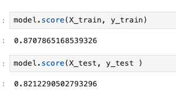
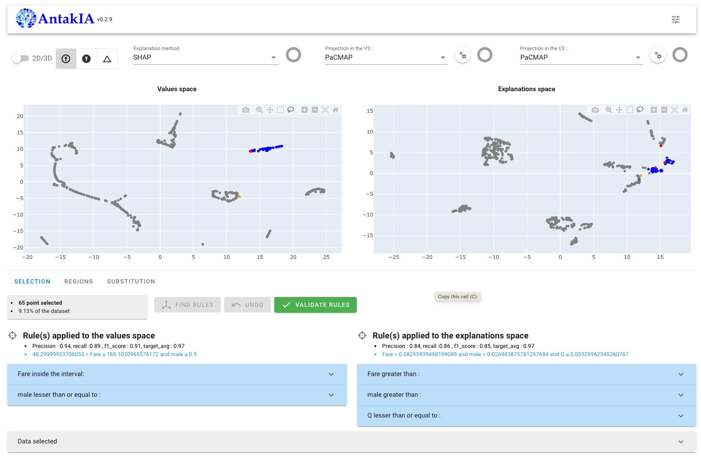
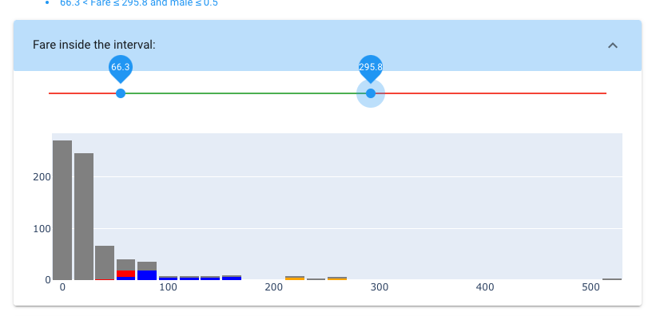
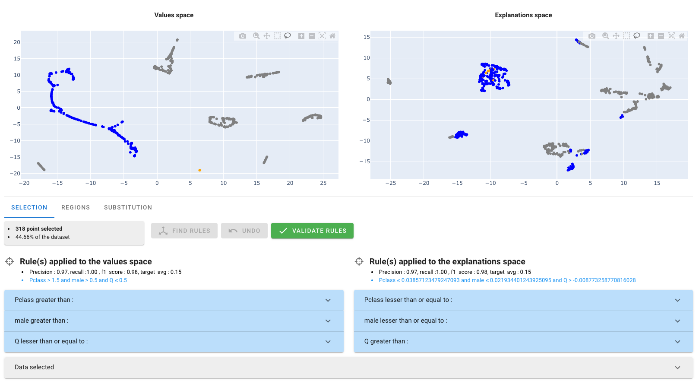
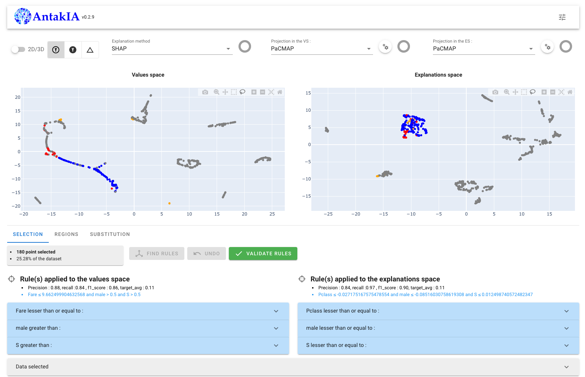
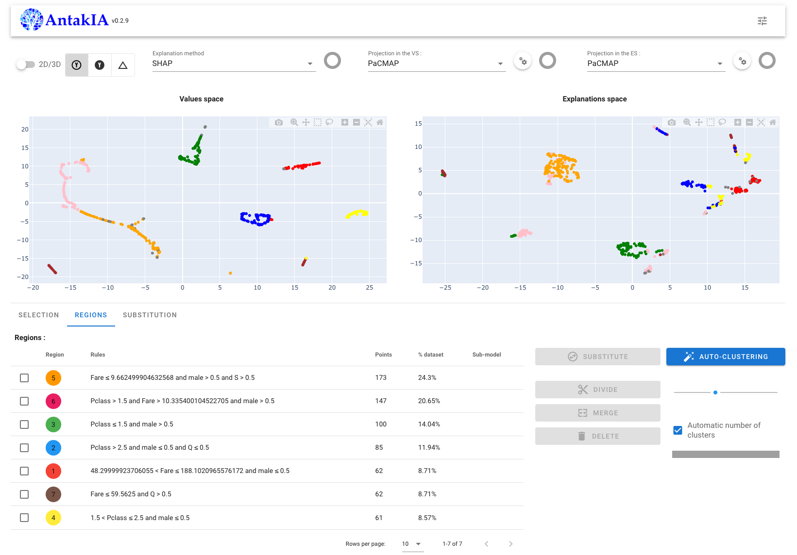
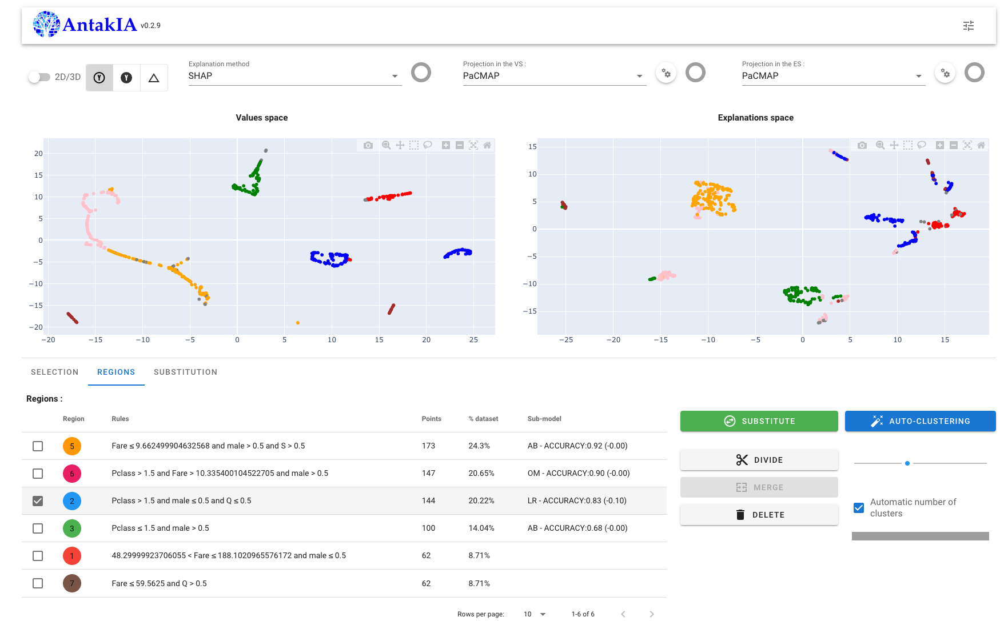
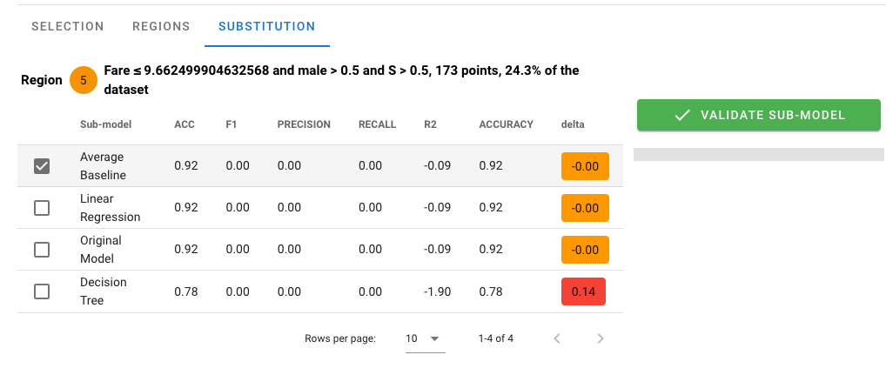
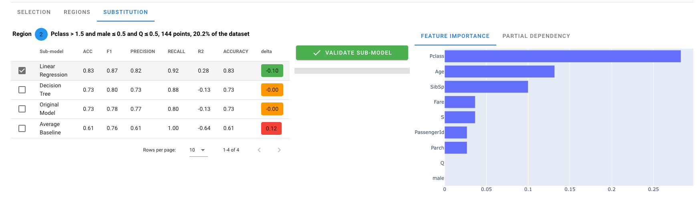

# Titanic Tutorial

For this tutorial we explore a well known toy dataset, representing all the passengers of the Titanic.
The goal is to predict whether they will survive the collision with the iceberg.

This tutorial presents how to use Antakia with a classification problem

## Data Overview

the dataset is composed by 12 columns :

| Variable    | Description                                  |
|-------------|----------------------------------------------|
| PassengerId | The passenger number                         |
| Survived    | Target variable                              |
| Pclass      | Travel class                                 |
| Name        | Passenger's name                             |
| Sex         | Gender                                       |
| Age         | Age in years                                 |
| SibSp       | No. of siblings / spouses aboard the Titanic |
| Parch       | No. of parents / children aboard the Titanic |
| Ticket      | Ticket number                                |
| Fare        | Passenger fare                               |
| Cabin       | Cabin number                                 |
| Embarked    | Embarked                                     |

## data collection and preparation.

Let's get's the data and prepare it :

To get the data simply run :

```ptyhon
import pandas as pd
from antakia.utils.examples import fetch_dataset
dataset = fetch_dataset('titanic', 'train')
```

Then to prepare it :

```python 
dataset['Age'] = dataset['Age'].fillna(dataset['Age'].mean())
dataset['Embarked'] = dataset['Embarked'].fillna('S')
Sex = pd.get_dummies(dataset['Sex'], drop_first=True)
Embarked = pd.get_dummies(dataset['Embarked'], drop_first=True)
dataset = dataset.drop(['Sex', 'Embarked', 'Name', 'Ticket', 'Cabin', 'PassengerId'], axis=1)
dataset = pd.concat([dataset, Sex, Embarked], axis=1)
```

The preparation include 3 steps :

- fill missing values
- one hot encode categorical variable
- remove columns with high cardinality

Then we shuffle it and split into test and train, and separate features and target :

```python
dataset = dataset.sample(len(dataset))
limit = int(2000 / 0.8)
dataset = dataset.iloc[:limit]
split_row = int(len(dataset) * 0.8)
df_train = dataset[:split_row]
df_test = dataset[split_row:]

X_train = df_train.drop('Survived', axis=1)  # the dataset
y_train = df_train['Survived']  # the target variable

X_test = df_test.drop('Survived', axis=1)  # the dataset
y_test = df_test['Survived']  # the target variable
```

Finally let's train a machine learning model, for example a random forest classifier

```python
from sklearn.ensemble import RandomForestClassifier

parameters = {
    'bootstrap': True,
    'criterion': 'entropy',
    'max_depth': 15,
    'max_features': 2,
    'min_samples_leaf': 5,
    'min_samples_split': 8,
    'n_estimators': 10
}
model = RandomForestClassifier(random_state=42, **parameters)
model.fit(X_train, y_train)
```

let's see how it performs :



## Model exploration with Antakia:

let's explore what the model has learned and if we can improve it.

to run AntakIA :

```python
from antakia.antakia import AntakIA

atk = AntakIA(
    X_train, y_train,
    model,
    X_test=X_test, y_test=y_test,
)
```

Note we can force antakia to classification behavior by passing `problem_category='classification'` as argument :

```python
atk = AntakIA(
    X_train, y_train,
    model,
    X_test=X_test, y_test=y_test,
    problem_category='classification'
)
```

and display the gui :

```python
atk.start_gui()
```


### 1. Data exploration:

We can see that 5 different blobs appear, with very different survivor rates:

By selecting the top right one, we can see that 97% of females, that paid between 48$ and 188$ survived



We can edit the rule to adapt it if necessary


Once we are done, let's validate it

If we select the big blob, we can see that it corresponds to several blobs in the Explanation space,


Let's select one blob in the explanation space


This new segment is more homogenous, even if we did not capture it perfectly.

By iterating this process we can divide our space into 7 regions :


### 2. Region refinement :

If the identified regions are not as good as desired, we can merge, divide or delete some of them.

We can for example merge the region 2 and 4



### 3. Model substitution

Once the main behaviors have been extracted, we can explore the model in each of these regions:

For example the performance of the 'Original model' on the region 5 is as good as the 'Average Baseline' model.
Inside this region, the model had not learn anything more.



For the region 2, the linear regression performs better than the original model :



On the right side we can explore the selected model to understand how the prediction was made.

## Conclusion

In this Tutorial we were able to explore a classification model on the titanic dataset.
We have identified 6 main regions :

1. Fare ≤ 9.7 and male and Embarked = S
    - 11% survivorship
    - best model : average baseline
2. Pclass = 2 or 3 and Fare > 10.3 and male
    - 21% survivorship
    - best model : customer model
3. Pclass = 2 or 3 and female and not Embarked = Q
    - 63% survivorship
    - best model : linear regression (Pclass, Age, SibSp)
4. Pclass = 1 and male
    - 45% survivorship
    - best model : average baseline
5. 48.3 < Fare ≤ 188.1 and female
    - 97% survivorship
    - best model : average baseline
6. Fare ≤ 59.6 and Embarked = Q
    - 36%
    - best model : linear regression (male, Parch)

We can then replace the original model by a new one, which consists in :
- the collection of surrogate model on each region, 
- e.g. the original model for the remaining points out of these regions.

The resulting model, built with AntakIA, is explainable and performs better than the original random forest.
We managed to improve the performance by 3% on the test set and gained knowledge about which passenger did survive or
not. 