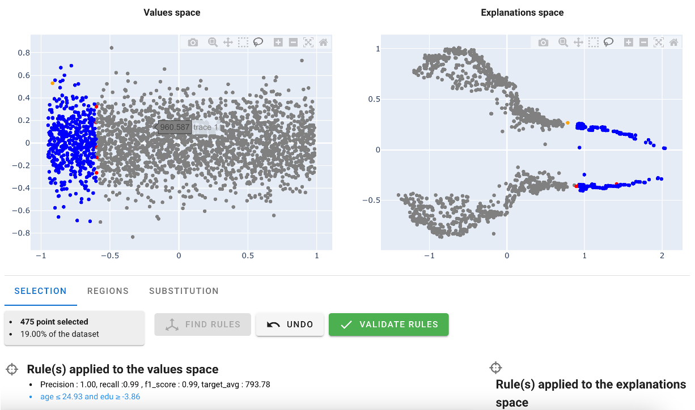
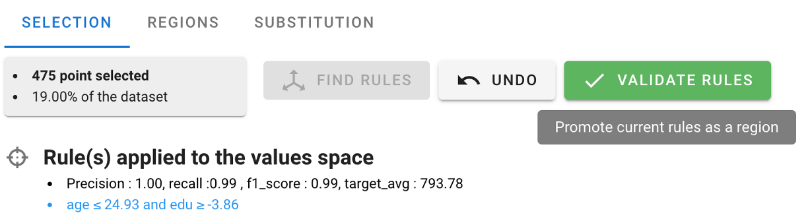

# Wages

This tutorial plays with a toy dataset, using self generated data. We've purposely defined a very simple and segmented by design phenomenon, added some noise, and then trained a complex enough model. We then use AntakIA in a blackbox approach, so try and identify the latent regions... and yes, we added so gendered-base biais, so see if we can spot it too.
off we go !

## the segmented phenomenon

### The dataset !
The wage (y) is a function of the age, the education level and the gender. We generated the data according to the following rules with some noise.
- young people(<25) have aleatory low salaries
- young adult (<40) increase their salaries according to their education level, and experience (age)
- people >40 have the same rules that younger people, but with a difference (Women are penalized...)

### The cheatsheet
We do have 4 natural regions : 
1. people <25 with aleatory values around a low average
2. people between 25 and 40 with linear dependency on age and education
3. men over 40, with linear dependency on age and education and discrimination
4. women over 40, with linear dependency on age and education and discrimination and slight disadvantage versus men
we know hope that AntakIA will help us identifiy those zones...

### The model
We trained an XGBoost to predict the wage. We confirm the global monotonicity of the model through the representation of beeswarms with SHAP library.

the segments are note obvious...

## exploring with AntakIA

### Dyadic display : ES and VS
we chose to use the linear reduction of dimension (PCA) for both the Explanation Space (ES) and the Value Space (VS). Here what comes to the fore :

### Exploring through the ES
The true innovation of AntakIA relies in taking into account the 'knowledge' retrieved from AI models, but hidden in the 'blackbox'... To unveil that, we explore the ES.
We identify that two clusters of similar wage levels are to be seen on the right. Let's select them in the ES : good news ! 
- we find some simple rules describing the selection in the VS, and the ES
- all the points in the VS are very close to one another
Hopefully, we'll be able to define a first region...

### Refining a region
AntakIA enables to explore at the predictor-level what the selection / region looks like. 
The first predictor used in the rule is the **age** (~< 25!):

we might extend slightly the value of the threshold and observe the relevance of the modification : the added points appear in orange either on the distribution...

... or in the dyadic visualisation : we can see that the added points 'jump' on other clusters in the ES... we should stay with the original value, to make the regions as consistent as possible, explanation wise. Nonetheless, we can see that some seemingly consistent points of the manual selection are not included in our rule (represented in red)

The second predictor in this rule is the **education** level :

The distribution of the selection is not different from the global distribution. There could be no reason to cut the lower part of it... 

So finally :
- age : we reverted to the inital value
- edu : we changeg the threshold to the minimum

we eventually got this representation : it looks like a region !

### Substituing by a simpler model on a region
We chose to go on to the next step : can we define a simpler model than the original one ?
We push the 'validate rule' button.

We reach the second screen listing the regions defined (one, so far). Let's select it, and push the 'substitute' button.

AntakIA automatically fits some alternate simpler, and more explainable models, benchmarking their comparative performance versus the original one.

This is where the Data scientist and the business expert have to ponder together on the subject, and come to a mutual conclusion. And especially, the moment where some DS know how should come into consideration. For example here, there does not seem to have a huge difference in performance, so the bias-variance trade off should advocate for choosing the simplest model. 
- the original model show very little dependence on any predictor in the range of the region == age<25 (looks at the PDP displays on the right, and the Feature Importance)
- other present very diverse behaviours (even decreasing with the age after age >25, or with the education)

so we chose stick to the simplest model. The original data were generated with pure noise around and average value : chosing this one could be a nice try ! let's go for it. We push the 'Validate Sub-model' button

AntakIA brings us back to the region tab, with a fresh new model on the region, briefly described.

Congrats ! we've just gone through the creation of our first region, and regional surrogate model :)

## Substituing the whole model

### going on with manual selection
You can just follow the above steps again and again, so that all the points of your dataset are tackled, assigned to a region, be it rule defined (whenever possible) or not.
But we also added a trick...

### auto-defining regions : 'I'm feeling lucky'
One other way to define other regions is to ask AntakIA to try and identify the regions by itself.
Starting after the creation of a first region e.g., we can also push the *'auto-clustering'* button.
Then AntakIA tries to run an automatic dyadic auto-clustering. Here is what we get :

AntakIA automatically suggests to tell data from the 'sex' value.
We could ask him to dive deeper : that's why the *'divide'* stands for

Selecting the red cluster, and applying the function gives the following result :

Two conclusions :
- AntakIA did propose a split at age 40 : cool !
- some yellow points are clustered in a small area : we see no obvious reason what they should keep separated from the green one

So we added a *'merge'* button. Selecting yellow and green regions, and merging them give us the following result :

Finally, doing the same with the remaining blue cluster, we obtain :

That'a a nice try :)

To finish the substitution, just repeat the *'substitute'* then *'validate sub-model'*, and you're done !
