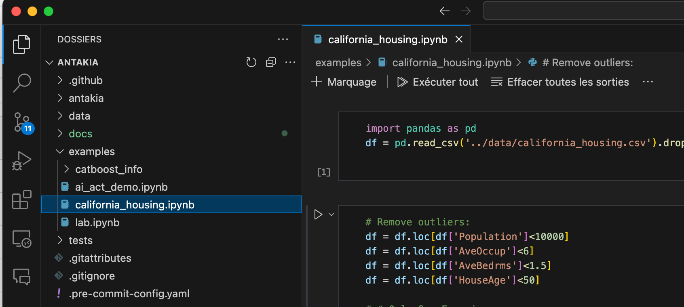

# Installation

## Install fron PyPi (recommended)

```
pip install antakia
```

## Install from source

Clone our repo :

```
git clone https://github.com/AI-vidence/antakia.git
cd antakia
```

If you use `poetry`:
```
poetry shell
poetry install
```

If you prefer `pip` :
```
python3.10 -m venv . # or >3.10
source bin/activate
pip install -e .
```

# Starting with example notebooks

**AntakIA is designed to work within notebooks (Jupyter or Google Collab for example)** Then you'll need a notebook to work with AntaakIA.

If you cloned our repo you'll find in the` ~/examples/` folder some sample notebooks (`.ipynb` files). Otherwise, you can download them manually from our [Github page](https://github.com/AI-vidence/antakia).

If you're note used with notebooks, here are common ways to run them
* locally :
   * right from Visual Studio Code
   * on a local Jupyter server
* on an online service hosting a notebook server : Google collab, a Jupyter hub (for many user) install in your university or company

## Running notebooks in Visual Studio Code

Open the notebook file (ending with the ipynb extension) in the file explorer on the left:



At the top right corner of the VScode windows, choose the Python kernel you wan't to use.

<div style="text-align:center"></div>

Select your normal Python interpretor if you installed antakia through `pip install`.

If you downloaded the code and have installed it by yoursel, make sure you chose the virtual environment you set up.

Then you can run the nootebok with these buttons :


## Running notebooks in a local Jupyter server

Go in your working directory where you have your data and notebooks.
```
cd <your_directory>
pip install notebook
```

Then launch the server with :
```
jupyter notebook
```
