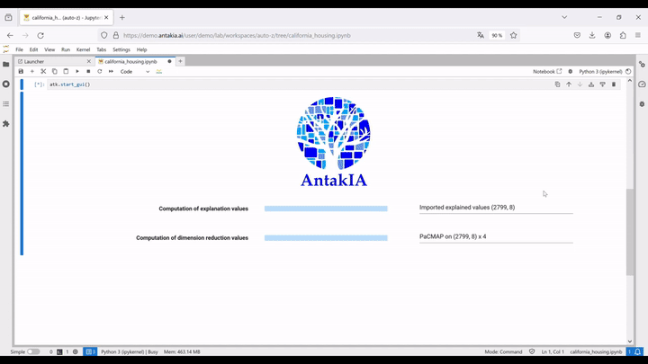

{: style="height:200px"}

# Welcome to AntakIA !

**AntakIA** is a software allowing you mainly to explore a trained machine learning (ML) model and discover what it has understood from the training data. A key issue for data scientist is to explain (one speaks of *explainability* of AI, aka X-AI) the model to have it adopted, and also in a short time certified to be compliant with the law. As a matter of fact, Europe has issue its *AI act* by the beginning of 2024. This text requires companies, when they use AI for certain use cases (*high risk*), to have their model certified, or sometimes self-certified.

AntakIA is a solution for this compliance issue. But it does more. For instancee it allows data scientist:

* to themselves better understand their dataset and model,
* help marketing teams to get new insights on their customers,
* help compliance officers to better understand the limits of the model,
* etc.

Here is a quick tour of AntakIA:


See full video on [Youtube](https://www.youtube.com/watch?v=wQFC_20OIOM)

AntakIA is an open-source project by [AI-vidence](https://www.ai-vidence.com), a French start-up commited on trustworthy AI. It showcases their regional approach for AI explainability.

1. Besides local and global explainability, we believe in a more relevant and intermediate scale to observe phenomena. Through a dyadic approach, it is then possible to divide accordingly the multidimensional space of input values in regions, sub-spaces where both the observations, and their explanations are alike.
2. Bonus : data scientists can consequently try and substitute the original black box model with simpler and explainable models on each region.

Because we split the space in smaller pieces, with simpler surrogate models on each piece, we named our approach from **the antique city Antakia** (in Türkiye nowadays) famous for its roman mosaics. By the way, it also stands for A New Tool to Acquire Knowledge from artificIAl intelligence, and that what've been working on for a while !

Now, you're only a ```pip install antakia``` away from AntakIA  :) ... See our [getting started](getting_started.md) page for detailed instructions


# Contents

Below is what you'll find in this documentation :

* [Getting started](getting_started.md) : install and usage
* [Tutorials](tutorials.md) : step by step guides to run AntakIA on some datasets
* [Regional explainability](regional_explain.md) and the science behind it
* [About](about.md) AI-vidence, the team behind AntakIA
* [Credits](credits.md)

### Logs

`antakia` is our open-source project. We plan to learn a lot from it to build our SaaS product, and earn our living. By default, `antakia` sends anonymous usage logs to our server. With this data, we cannot discover who you are, what you do, or what data you work on. It only tells us how people use the software. However, if you don't want us to receive this data, just create a `.env` file at the root of your project folder with the following line `SEND_ANONYMOUS_LOGS=false`