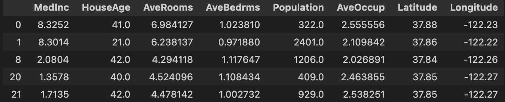
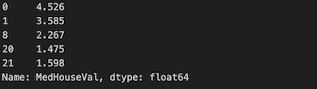

# Tutorial (1/2)

This is the part 1 of our tutorial. It explains how to prepare data and launch AntakIA. Those steps are common to most of AntakIA usages. If you feel familiar enough, you can directly jump to the [second part](tutorial2.md).

## The California housing dataset

We'll use the [California housing](https://inria.github.io/scikit-learn-mooc/python_scripts/datasets_california_housing.html) dataset, very famous in the datascience ecosystem.

This dataset describes 20 640 block groups (ie. groups of houses) in California using 8 variables :

| Variable | Description |
| -------- | ----------- |
| MedInc  | median income in block group |
| HouseAge | median house age in block group |
| AveRooms | average number of rooms per household |
| AveBedrms | average number of bedrooms per household |
| Population | block group population |
| AveOccup | average number of household members |
| Latitude | block group latitude |
| Longitude | block group longitude |


The dataset also gives for each block group the average price of a house. This data comes from real real estate transactions.

In our noteboox, this dataset is stored in a Pandas Dataframe named `X`.
If you type `X.head()` you'll get :



The "medium house values" are stored in a Pandas Series named `y`.
A `y.head()` will give you something like :



## The use case

We can imagine several use cases where AntakIA could be useful:
* Let's say you're a real estate agent in California. A data scientist in your team has trained a wonderful ML model that is capable of predicting the market value of any house in the state, as long as you provide sufficent data. You're amazed and want to understand how this model works in order to gain insights of your market: what drives the price ? any segmentation ? So you decided to use AntakIA.
* Or, you don't have such model. But you still want to have an accurate understanding of your market. Then you ask a data scientist to train a model. Add then you use AntakIA on it.

It's quite the same story: you have a dataset `X`, you do a supervised training on (`X`,`y`) to get a fitted model M. AntakIA will help you to understand how and why M can predict house values.

## Preparing the data

Launch a Jupyter server and open the notebook `california_housing.ipynb` (see [Getting started](getting_started.md) page).

Let's analyze the first cells :

```
import pandas as pd
df = pd.read_csv('../data/california_housing.csv').drop(['Unnamed: 0'], axis=1)
```

We start creating a dataframe from a local CSV file. You could have imported this dataset from the Scikit-learn package [here](https://inria.github.io/scikit-learn-mooc/python_scripts/datasets_california_housing.html). As you'll see, AntakIA needs to compute other values (eg. SHAP values for the data and the model). So make this tutorial quicker and more pleaseant, our CSV file includes these pre-computed SHAP values.

```
# Remove outliers:
df = df.loc[df['Population']<10000] 
df = df.loc[df['AveOccup']<6]
df = df.loc[df['AveBedrms']<1.5]
df = df.loc[df['HouseAge']<50]

# # Only San Francisco :
df = df.loc[(df['Latitude']<38.07)&(df['Latitude']>37.2)]
df = df.loc[(df['Longitude']>-122.5)&(df['Longitude']<-121.75)]
```

In the same way, the previous lines are not compulsory. But it appears that the dataset for the sole city of San Francisco is better to get rapidly a good intuition of how AntakIA works.

```
X = df.iloc[:,0:8] # the dataset
y = df.iloc[:,9] # the target variable
shap_values = df.iloc[:,[10,11,12,13,14,15,16,17]] # the SHAP values
```

Here we have extracted from our big CSV dataset : the `X` values, the `y` Series and the `shap_values` (we'll explain those values further).

```
from sklearn.ensemble import GradientBoostingRegressor
model = GradientBoostingRegressor(random_state = 9)
model.fit(X, y)
```

We decided to use a GradientBoosting model and have it trained (or fitted) on our data. Now our data is prepared and our model trained, we can then launch AntakIA :

````
from antakia.antakia import AntakIA
atk = AntakIA([X], y, model)
atk.start_gui()
````

It's that simple !

Yet, in this tutorial we'll use another method to launch AntakIA :

```
from antakia.antakia import AntakIA

variables_df = pd.DataFrame(
    {'col_index': [0, 1, 2, 3, 4, 5, 6, 7],
    'descr': ['Median income', 'House age', 'Average nb rooms', 'Average nb bedrooms', 'Population', 'Average occupancy', 'Latitude', 'Longitude'],
    'type': ['float64', 'int', 'float64', 'float64', 'int', 'float64', 'float64', 'float64'],
    'unit': ['k$', 'years', 'rooms', 'rooms', 'people', 'ratio', 'degrees', 'degrees'],
    'critical': [True, False, False, False, False, False, False, False],
    'lat': [False, False, False, False, False, False, True, False],
    'lon': [False, False, False, False, False, False, False, True]},
    index=['MedInc', 'HouseAge', 'AveRooms', 'AveBedrms', 'Population', 'AveOccup', 'Latitude', 'Longitude']
)

atk = AntakIA(X, y, model, variables_df, shap_values)
atk.start_gui()
```

Two differences with this method :

1. we've passed to AntakIA a description of the dataset variables :
* description
* it critical ?
* do we have geographical data ?
* type of the variable
* which unit is used ?

2. we've also passed pre-computed SHAP values.

Now we're ready to discover AntakIA. You can go to [the second part of our tutorial](tutorial2.md).
