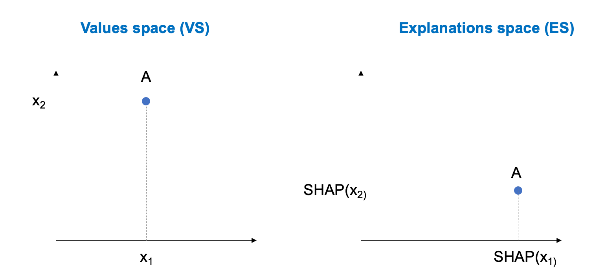
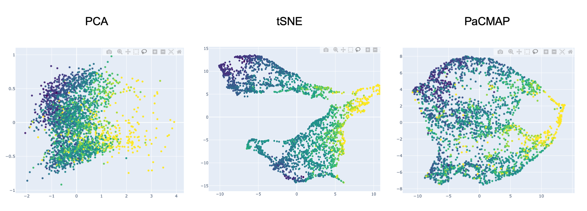
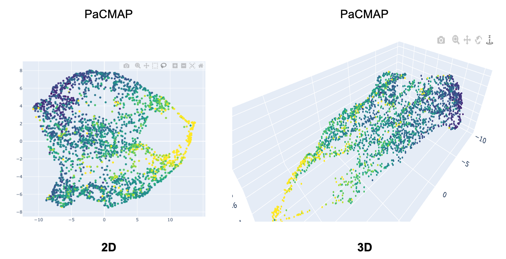

# Tutorial (2/2)

This is the part 2 of our tutorial. We'll dive into the actual use of AntakIA. If you have questions on the California housing dataset and how to start AntakIA, you should the [first part](tutorial1.md) of the tutorial.

## The AntakIA UI

### A first glimpse of AntakIA

> [!IMPORTANT]
> The main idea of our AntakIA method is to divide the dataset `X` in several parts (we say "regions", hence the regional explainability) where we can substitute the inital complex trained model (often reffered to as a black box) with simple and explainable models, one for each region.
 
Then the main question is : how to define these regions ?

> [!IMPORTANT]
> The AntakIA method consists in finding clusters in **two spaces** at the same time : the space with our `X` values (aka "values space" or "VS"), and a space with the same records, but using, as variables, the explanation for each variables. We call the latter the "explanations space" or "ES". Put another way, VS shows the values as we seee them, and ES shows the same values, but as the trained model sees them.

Then, finding relevant regions consists in finding clusters in VS corresponding to clusters in ES. Then we find regions where records are alike **and** records are explained similarly. **Then, on these regions we can find simple models, with few variables that are explainable and replace the former "black box".**

### The different dataset at stake

We introduced the iead of "explanation values". To get an intuition of it, let's consider a dataset with only 2 variables x1 and x2. Now let's take a look at one specific record A. We can plot it on a 2D value space. To compute the explanation values, different methods exist. In AntakIA we use two of them : SHAP and LIME. In the "explanations space" A's coordinates or the importance of variables x1 and x2 according to SHAP for the predictions by the model :

 
Of course this is a very simple example. Since our California housing dataset `X` has 8 variables, we would need to display an 8-dimension space ! Of course it's not feasible : a human can only understand 2D ond 3D representations.

Hence the idea of **dimensionality reduction**. Various techniques can project a N-dimension space in 2 dimensions. Some are illustrated below :

 
These dimensionality reduction technique can also project in 3D :
 

### The splash screen

### The main window

### Exploring the dataset with a dyadic view

### Understanding the Antakia worlflow

## Finding a suitable region

## Substitution the intial model with a surrogate model

## The auto-clustering way
