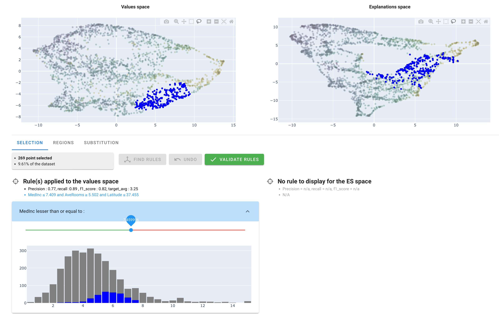
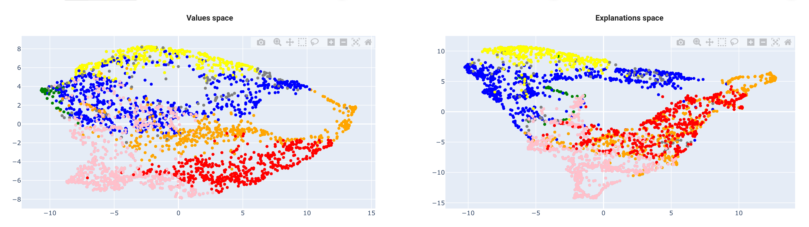

# Tutorial (2/2)

This is the part 2 of our tutorial. We'll dive into the actual use of AntakIA. If you have questions on the California housing dataset and how to start AntakIA, you should start with the [first part](tutorial1.md) of the tutorial.

## The AntakIA UI

### A first glimpse of AntakIA

> [!IMPORTANT] 
The main idea of our AntakIA method is to divide the dataset `X` in several parts (we say **"regions"**, hence the *regional explainability*) where we can substitute the inital complex trained model (often reffered to as a **black box**) with simple and explainable models, one for each region.

Then the main question is : how to define these regions ?

> [!IMPORTANT] 
The AntakIA method consists in finding clusters in **two spaces** at the same time : the space with our `X` values (aka "**values space**" or "**VS**"), and a space with the same records, but using, as variables, the explanations for each variables. We call the latter the "**explanations space**" or "**ES**". Put another way, **VS shows the values as we seee them, and ES shows the same values, but as the trained model sees them.**

Then, finding relevant regions consists in finding clusters in VS corresponding to clusters in ES. Then we find regions where records are alike and records are explained similarly. **Then, on these regions we can find simple models, with few variables that are explainable and replace the former "black box".**

### The different dataset at stake

We introduced the idea of "explanation values". To get an intuition of it, let's consider a dataset with only 2 variables x1 and x2. Now let's take a look at one specific record A. We can plot it on a 2D value space. To compute the explanation values, different methods exist. In AntakIA we use two of them : SHAP and LIME. In the "explanations space" A's coordinates or the importance of variables x1 and x2 according to SHAP for the predictions by the model :


This is a very simple example : since our California housing dataset `X` has 8 variables, we would need to display an 8-dimension space ! Of course it's not feasible : a human can only understand 2D ond 3D representations.

Hence the idea of **dimensionality reduction**. Various techniques can project a N-dimension space in 2 dimensions. Some are illustrated below :


These 2D plots illustrate our California housing dataset projected in 2D using the [PCA](https://en.wikipedia.org/wiki/Principal_component_analysis), [t-SNE](https://en.wikipedia.org/wiki/T-distributed_stochastic_neighbor_embedding) and [PaCMAP](https://github.com/YingfanWang/PaCMAP) techniques. Note, AntakIA also proposes the [UMAP](https://umap-learn.readthedocs.io/en/latest/) method.

These dimensionality reduction technique can also project in 3D :


### The splash screen

When you type `atk.start_gui()` the application shows a splash screen first :


AntakIA needs computed explanation values in order to display the ES.

If you passed to AntakIA some pre-computed explanation values, such as `shap_values`, then you'll see in the splah screen that the first progress bar isn't active and its status is *ìmported explained values*. Otherwise you would have to wait for its computation.

As we saw earlier, we also need to compute the dimensionality reductions for both VS and ES spaces. Since we display the values in 2D and 3D, we have 4 computations. That's what is shown on the second progres bar of the splash screen. Note we only compute projections for the default reduction technique.

> [!NOTE] 
You can put in your working directory an `.env` file with some default values for AntakIA.

Below is an example of such an .env file :

```
DEFAULT_EXPLANATION_METHOD = 1 # 1 for SHAP (default), 2 for LIM
DEFAULT_DIMENSION = 2 # 2 (default) or 3
DEFAULT_PROJECTION = PaCMAP # PCA, UMAP or PacMAP (default)

MAX_DOTS = 5000 # default. Max dots to display, for you CPU sake

# Rule format
USE_INTERVALS_FOR_RULES = 'True' # intervals use the [a,b] notation
SHOW_LOG_MODULE_WIDGET = 'False' # default, a logging tool for debug

#Auto cluster
MIN_POINTS_NUMBER = 100 #minumum number of point to allow autocluster and substitution
```

### The main window

Here is an explanation fo the main window generic tools :


## Understanding the Antakia worlflow

AntakIA workflow can be summarized as below :

1. find some points in one space such as the corresponding points in the other space aren't too sparse / are grouped
2. find rules on the dataset variables that matches this selection
3. adjust these rules according to your needs
4. add this rules-defined zone to your list of "region"
5. chose a submodel for substitution
6. start again from step 1


## Applying AntakIA workflow on our dataset

### 1. Find a "good" selection

The example below is a pretty good example :


As previously explained, the idea is to find regions homogenous in both spaces at the same time.

Using the "lasso" tool, you can select points in one space, and then, see the corresponding selection in the other space.

> [!IMPORTANT]
If you want to empty your selection, just do a multiple click anywhere in a grey area.

In this example, we see a region in the VS space, with a relatively homogeneous counterpart in the ES space :

* dots in VS are grouped : they are closed (the distance is small), so they are similar. In our example, this means we have selected block groups with similar attributes
* dots in the are also groupes : this means the model predicts their price values similarly, ie. their descriptive variables play a nearly identical role in the prediction

### 2. Find rules matching our selection

Whenever the selection is not empty, you'll see a blue "Find rules" button :


You can click it. It launches an algoritm called Skope rules that tries to find rules to describe your selection :



Actually, Skope rules is a binary classifier : it predicts wether a record belongs to your selection (positive) or not (negative). The dots in blue correspond to the positives records of the rules found, for both VS and ES.

Under the title "Rule(s) applied to the values space", you can read the rules that have been found : Here, it is `MedInc <= 7.409 and AveRooms >= 5.502 and Latitude <= 37.355`.

> [!NOTE]
Rules have only been found in the VS. As a matter of fact, the Skope rules algorithm doesn't systematically find rules in both spaces. Here, it didn't find rules (expressed with a subset of our 8 variables) able to describe the ES selection (with explained values) effectively.

### 3. Adjust the rules

On the last picture, you see, under the rules, 3 sliders to adjust the thresholds of the rules, one for each variable.

Working with a "market expert" (here, a real estate expert) you may adjust those threshold to match specific values.

### 4. Validate the region

When you're done, you can click on the "validate rules" button

When a set of rules has been validated, AntakIA show another tab named "Regions" :


You see the region has been given a color, here : red.

### 5. Substitute the initial model with a surrogate model

Now you can either go back to step 1 and find another region, or find a submodel for substitution. Let's do this.

In the table, select the region with the checkbox, then click on the "substitute" button.

What you see is a proposal of submodels :


You can read the performance of various surrogate models, compared (delta) with the orginal model.

You can select one model and "validate sub-model" to add the submodel in your region list.

## The auto-clustering way

This dyadic exploration provides many insights both for the data scientists, the "market expert person" and compliance officer.

Instead of finding each region one by one, you can try our auto-clustering method. In the "Regions" tab, click on the blue button "auto-clustering". You can uncheck the "automatic numnber of clusters" if you want to force it.

Below is an example of what you can get :



It's often a good way to start, then refine your regions !

Hope you enjoyed this tutorial !
