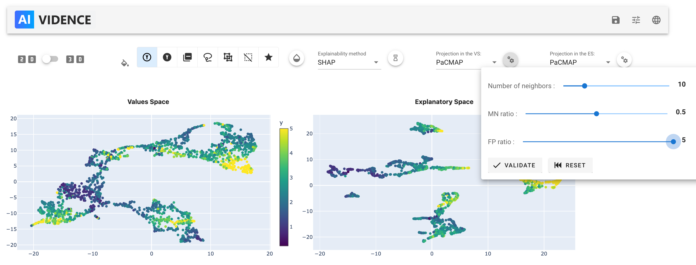
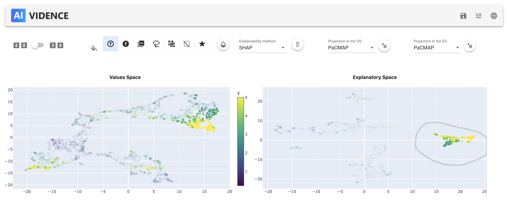
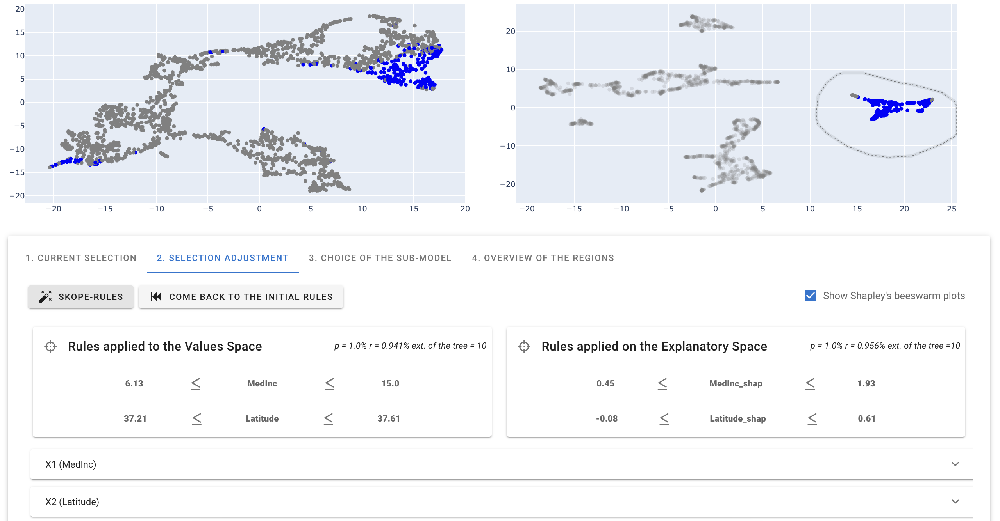
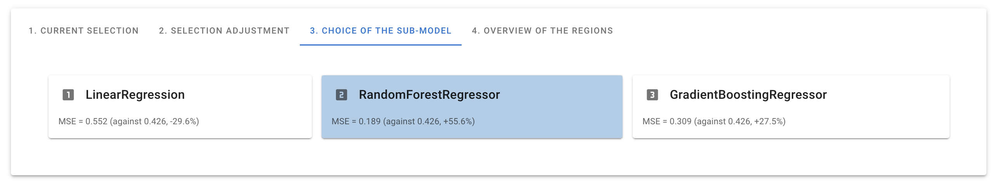
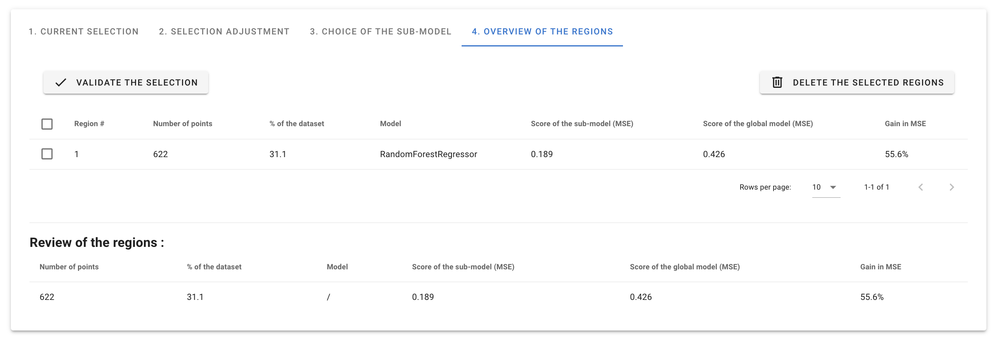
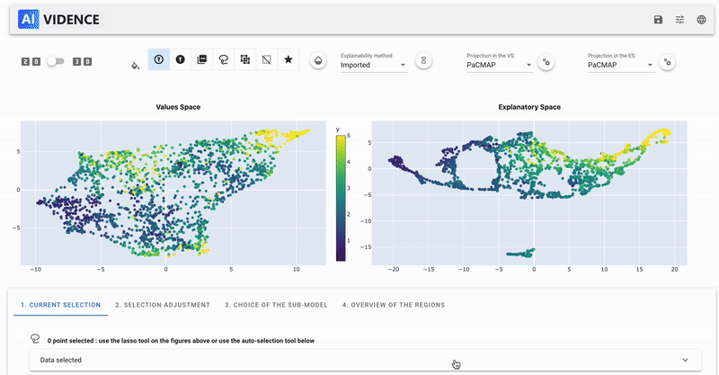

# User guide

Here is a simple use case of the AntaKIA package.

_(find more examples in the <a href="https://github.com/AI-vidence/antakia/tree/main/examples">this folder</a>)_

## Using the GUI

### :rocket: Launch the GUI

After installing the package (see [here](getting-started.md)), you can use the package in a notebook:

```python
import pandas as pd
df = pd.read_csv('data/california_housing.csv')
X = df.iloc[:,0:8]
Y = df.iloc[:,9]
SHAP = pd.read_csv('data/pre_computed_SHAP_values.csv')
```

```python
from sklearn.ensemble import GradientBoostingRegressor
model = GradientBoostingRegressor(random_state = 9)
model.fit(X, Y)
```

```python
import antakia

dataset = antakia.Dataset(X, model = model, y=Y)
atk = antakia.AntakIA(dataset, explain = SHAP)
atk.startGUI()
```


### :pencil: Modify the explainability method and the projections

We can first modify the explainability method 


and then the projections, by choosing between the different projections available or by modifying the parameters of the projection!



### :mag: Create our first Potato

We can now create our first Potato. Select the region of interest on one or the other space, and visualize the points selected in the other one.



### :straight_ruler: Apply Skope-Rules

We can now apply Skope Rules on the selected region, in order to define it with a set of rules on the features.



### :control_knobs: Modify the rules

We can now modify the rules, by changing the parameters of the rules, or by adding or removing rules.
This feature come with interesting data-visualization tools!


### :control_knobs: Apply sub-model

We can now apply a sub-model on the selected region. The sub-models are to be choosen in the list of the available models. To import your own modles, please refer to the [documentation](documentation/antakia.md).



### :white_check_mark: Validate the region

We can now validate the region, and add it to the list of the validated regions.



### :magic_wand: Have everything done for you : the magic button !

Click the button on the very bottom of the GUI, and let the magic happen !
The potatoes are created automatically using our dyadic-clusterign algorithm, skope-rules are found, the best submodel is chosen and the region is added to the list !
For more information about the dyadic-clustering, see [utils](documentation/utils.md).



# In command lines